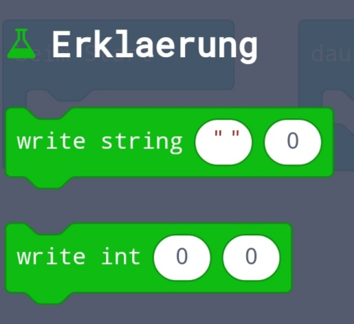

# Demonstration für Informatikunterricht
Demonstration eines Blockes für den Info Unterricht. 
## Installation
Für Script:
Rufen Sie [Makecode](makecode.calliope.cc) auf
und importieren Sie eine [Datei](
demonstrationInformatik/src/Importierbar/
) als Erweiterung. 

Für Block:
Eine [Datei](
demonstrationInformatik/src/Importierbar/
) als Projekt öffnen
## Usage
Javascript:
```Javascript
Erklearung.writeString(String Text);
Erklearung.writeInt(Int Zahl);
```
Python:
```python
Erklearung.writeString(String Text)
Erklearung.writeInt(Int Zahl)
```
Blockly:


## Code Beispiele
`Erklearung.writeString("Hello World!");`(Not Working)
## Eigene Zeichen
In der [Datei](src/Creator/Usage.md) zu lesen
## Fehler
-Keine doppelten Buchstaben in einem String
